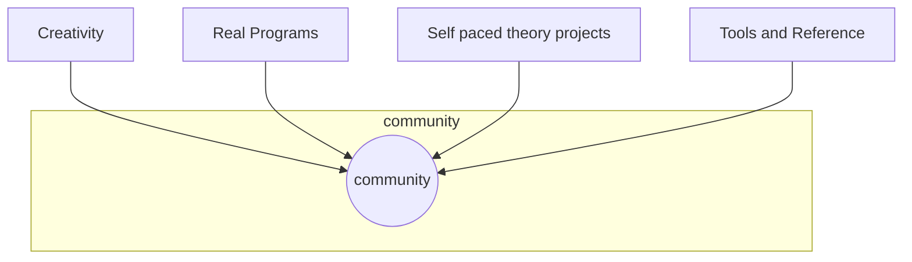

How to teach Computing
======================

TODO
I need to cross reference all of this against
* [Teaching Tech Together: How to create and deliver lessons that work and build a teaching community around them](https://teachtogether.tech/) 2019 Greg Wilson
    * Free eBook
    * Amazing insights into teaching Computing

---

* Purpose/Goal
    * Qualification?
    * Game?
    * Build at a Hack day?
    * Social/Atmosphere (time well spent)
* Spec given to students
    * Spec bingo -> tick + ask
* CheatSheet - encourage freely move between languages
* Projects for the year (in advance)
    * Autonomy and responsibility
        * Any order
        * Optional extensions (with indication of grade/skill/ability)
    * tackled in any language (see cheatSheet)
    * Lessons become consultations
    * Leverage peers
        * Code reviews
        * Pair programming
    * Theory covered by practical tasks
    * conceive, design, implement and operate - [CDIO](https://en.wikipedia.org/wiki/CDIO_Initiative) [cdio-standards-30](http://cdio.org/content/cdio-standards-30)
* Public repos
    * Version control
    * Transparency
* Automated tests
    * doctests
    * auto assessment to spec?
* Automated questions + answers
    * for individual
* Guided projects (bank of)
    * (See Purpose-First programming below)
    * Actually create something
    * Sense of achievement
    * Accessible independently
    * context, real
    * (See conversational programmers Cunningham)
* Theory guided by regular interleaving of exam questions on paper
* Mix it up!
    * Sometimes don't even tell them what the lesson is about - just show them some code and Predict, Run, Investigate (PRIMM)
        * E.g. by ref or by val example
    * Conduct an entire session as mutes (no talking at all by anyone - except emergencies)
    * Just use 'off' hand - (somehow restrict dominant hand in a fun/non-intrusive way?)
    * Don't touch the mouse (unplug it!)
* Final self directed Personal project (A-level project)
    * Culmination of skills
    * Create a game?
    * Hardware? HCI? Output DMX?
* Creativity
    * Self directed/conceived projects for the joy/sake of it
    * Demoscene
* Meta-cognition (concept?)
    * Structured Retrospectives
    * Process + actions
* Group Wiki (concept?)
    * Publicly visible?
    * 'Who can' list?
    * Group solutions to code problems?
* Peer Mentor (with a big enough and multiple generation group)
    * Learners are paired with (slightly) more experienced mentor
        * The course lead can pair appropriately by ability/personality
    * Have a 'Who can' list? direct students to each other for examples of identified practice.
    * Servant leadership
    * Could be external?
* Show cool relevant cultural stuff
    * Decentralisation
    * Snowden/Privacy
    * AI examples - Deepfakes?
        * https://experiments.withgoogle.com/collection/ai
        * https://machinelearningforkids.co.uk/
        * https://teachablemachine.withgoogle.com/
        * https://www.appsforgood.org/courses/machine-learning
* Hack time presentations (concept)
    * bring something cool?
    * Show feature/tool you've encountered
* Regular pair-program a programming challenge
    * Different (rotate) partners each time
    * What makes you a good pair partner - what are good partner traits?
    * Respect/understanding for your partners current level/belt/development
* Encourage participation at an event
    * HackDay
    * BarCamp (local tech culture meet/present)
    * Competitions (british informatics olympiad? robotics?)
        * olympiad.org.uk + bebras.org + ioinformatics.org + bebras uk + 
* Real Exam (gcse or A-Level)
* Community
    * A 'hang' space
    * Learning though conversation
        * Challenging ideas
        * Consolidate learning/thinking

Continue someone elses project? games? add feature?
Take interest in their outside projects - showcase them? (like hack time presentations)
Role model?
Ownership of own learning

* [On a Metodology for Creating School Curricula in Computing](https://ioinformatics.org/journal/v11_2017_93_107.pdf)

* My preference is Teach algorithums at the _program level_
* [Teaching algorithms in upper secondary education: a study of teachers’ pedagogical content knowledge](https://www.tandfonline.com/doi/full/10.1080/08993408.2021.1935554)
    * >  introducing computing concepts without the use of a computer may keep “learners from the crucial computational experiences involved in CT’s common practice”
    * > “the ‘programming vs. Unplugged’ debate should not be an ‘either-or’ debate”
    * > assessment is often combined with a specific programming environment
        * overlap between object level and program level
    * > “students would be attracted by a feeling of recreation – in-the-moment enjoyment”
    * PCK - Magnusson et al. (1999)
        * knowledge of goals and objectives for teaching a specific topic in the curriculum, (GO)
        * knowledge of students’ understanding of this topic, (SU)
        * knowledge of instructional strategies concerning this topic, (IS)
        * knowledge of ways to assess students’ understanding of this topic (AS)
        * combinations of PKC in the form GO-IS
    * > It is about the analysis of a problem and what we need to come up with a solution … What we miss in secondary education is to first think about what is needed, what is the goal, how we get there, and what steps can be distinguished.
    * > too much focus on the syntax and distract from the problem-solving process. Futschek (2006) 

* Principles
    * Theory (lectures) _when needed_ and interesting dynamic
    * Creativity/Choice
        * Hard timetable, tasks are authoritative and hierarchical - this establish's a non desireable mode of thinking
    * Developer Culture/Community/Peer-network/collaboration
    * Low stakes at ALL stages
    * No competition / hierarchy / judgement
        * Their progress is under their own ownership
    * Participate in community
    * Convey principles/concepts over Tooling (be explicit about this to learners)
    * Real context/purpose, society focused
    * Consider emotional understand to foster engagement
        * [Emotions and programming learning: systematic mapping](https://www.tandfonline.com/doi/full/10.1080/08993408.2021.1920816)
        * Ellis and Tod - relationship with curriculum
    * Vancus 2009 - no reason to engage if no visible use for it
    * Wingfield and Eccles (1992) "Utility Value"

> Seymour Papert introduced the Logo language in the 1970s and watched how children got excited by computing and learned how to think computationally. He attuned Logo to children's interests; even so, it still took students time to move from the fascination of the introduction to the ability to program useful computations regularly.
https://cacm.acm.org/magazines/2017/3/213837-misconceptions-about-computer-science/fulltext

Thought - you cant just use someone else's resources
There are loads of good teaching resources out there. An entire planet of teachers creating and sharing resources. The reality is that people out their have (collectively) more experience and aught better than you ever could.
By they are not in your classroom with your students.
You could just say to your students 'you have the internet, go and learn about computer science'. But that wont work.
There is only one solution.
As a teacher, you need to do all these computing activities, you need to love something and make cool projects. You're understanding of the discipline and working though the problems is required.
It's not really possible to _use_ another teachers resources until you _understand_ them. And they only way to understand them is to complete them or create them.
Teachers need time to immerse themselves in the subject and explore. It's the only way they can be effective.

Investigate
* [Teaching and Learning with Jupyter](https://jupyter4edu.github.io/jupyter-edu-book/)

* [Code Reading Club](https://www.felienne.com/archives/6472)
    * Reading code is harder than writing code
    * We are VERY bad at teaching learners to read code

Partial programs (force read + understand)
Parson problems
Swap programs and add a feature to another persons codebase

> Barnett and Coate’s (2005) view of the curriculum in higher education as deliberately designed to engage students, among others. They write of
>> the imaginative design of spaces as such, spaces that are likely to generate new energies among students and inspire them, and so prompt their triple engagement – in knowing, acting and being. (3)

* [Maths e.g](http://www.mathcentre.ac.uk:8081/mathseg/index.jsp) - online site that individually programmatically generates questions and worked examples

TODO
See also CompterSciencePedagogy in teaching workshops
See also learning-to-code.md in mapOfComputing

Other
-----

* [First Year Computer Science Projects at Coventry University: Activity-led integrative team projects with continuous assessment](https://arxiv.org/abs/1911.11088)
    * > We describe the group projects undertaken by first year undergraduate Computer Science students at Coventry University. These are integrative course projects: designed to bring together the topics from the various modules students take, to apply them as a coherent whole. They follow an activity-led approach, with students given a loose brief and a lot of freedom in how to develop their project.
      > We outline the new regulations at Coventry University which eases the use of such integrative projects. We then describe our continuous assessment approach: where students earn a weekly mark by demonstrating progress to a teacher as an open presentation to the class. It involves a degree of self and peer assessment and allows for an assessment of group work that is both fair, and seen to be fair. It builds attendance, self-study / continuous engagement habits, public speaking / presentation skills, and rewards group members for making meaningful individual contributions. 
* [Learn proramming in 10 years](https://norvig.com/21-days.html)
    * Work on projects _with_ other programmers
    * Work on projects _after_ other programmers
* [CHI 2021 | Purpose-first programming works for conversational programmers](https://www.youtube.com/watch?v=flLjtC1QfD0)  Katie Cunningham 2021
    * [Avoiding the Turing Tarpit: Learning Conversational Programming by Starting from Code’s Purpose](https://dl.acm.org/doi/10.1145/3411764.3445571)
    * [Katie Cunningham’s Purpose-first Programming: Glass box scaffolding for learning to code for authentic contexts](https://computinged.wordpress.com/2021/06/21/katie-cunninghams-purpose-first-programming-glass-box-scaffolding-for-learning-to-code/)
    * Conversational Programmers (High level patterns - in blocks)
    * Build working program in chunked examples
    * (Kind of like my engineering projects - felt success - felt real world)
    * [Mismatch of Expectations: How Modern Learning Resources Fail Conversational Programmers](https://dl.acm.org/doi/10.1145/3173574.3174085)
* Parallels in MFL?
    * [Study shows exposure to multiple languages may make it easier to learn one](https://www.washington.edu/news/2019/09/05/study-shows-exposure-to-multiple-languages-may-make-it-easier-to-learn-one/)

* Assessment in PE
    * Idea - Could some of these techniqies be used to assess the qualitys we want to see in Computer science? Make them accessible? 
    * Physical
        * Fitness Level
        * Skills development
        * Tequnique
        * Decition Making
        * Competetive
    * Social
        * Communication
        * Movivation
        * Respect
        * Sportsmanship
        * Commitment
    * Leadership
        * Movtivation
        * Communiaton
        * Teamwork
        * Empathy and kindness
        * Cooperation
    * Coaching
        * Rules
        * Tactics
        * Technique
        * Use of terminology
        * Lead a warm up

* [10 Creative Risks to Take With Your Students This Year](https://spencerauthor.com/creative-risks-new-year/)
    * WIth class's
        * Engage with wonder
        * Collaboration
        * Blog about what your passionate about
        * hack time
    * Very similar principles to productive adults

* [How to help a student get unstuck](https://offbyone.us/posts/how-to-help-a-student-get-unstuck/) 2021 (short 5min article)
    * Forget about the program, focus on the programmer
    * Don’t let them overheat
    * How to teach #
        * Try to ask questions more often than you give information.
        * avoid touching a student’s keyboard. 
        * prompt the student to summarize what they’ve learned.
    * How to debug
        * even professional programers get stuck, and that there’s a methodology for getting unstuck.
    * How to support
        * Hear their concerns and anxieties, and let them know that they’ll get through it.
        * Lots of early stage programmers don’t realize that it’s normal to struggle
    * Putting it all together

* [The Computer Science Student-Centred Instructional Continuum - CS-SCIC](https://blog.teachcomputing.org/the-computer-science-student-centred-instructional-continuum/) NCCE citing (Waite & Liebe, 2021)
    1. Copy code: students are given step-by-step instructions to follow, e.g. copy an example program;
    2. Targeted tasks: students are given a short task, e.g. fix buggy code, Parsons problems;
    3. Shared coding: the teacher thinks aloud as they design and write code, sometimes called demonstrating or live coding, e.g. teacher models how to write a program;
    4. Project-based: students are provided with a project goal and create a solution, e.g.create a quiz in Scratch;
    5. Inquiry-based: students consider a scenario or question and create a solution, e.g. explore a set of code commands and discover ways to use them;
    6. Tinkering: completely unstructured student-led exploration, e.g. explore a software”

* [Summary of Semantic Transfer in Programming Languages: Exploratory Study of Relative Novices](https://blog.teachcomputing.org/summary-of-semantic-transfer-in-programming-languages-exploratory-study-of-relative-novices/) dec 2020
    * when a second language is encountered
        * A carryover concept (similar meaning in both the old and new context)
        * A changed concept (different meaning in the new context)
        * A novel concept (completely new to the learner)

---

 Collaborating with other professionals

 * [Pedagogy by proxy: developing computing PCK through shared lesson resources](https://sure.sunderland.ac.uk/id/eprint/13728/) Hidson, Elizabeth (2021)

* [Exemplary Progress: A network to share best practice](https://mirandanet.ac.uk/wp-content/uploads/2019/06/exemplary_progress_fe.pdf) Becta 2008
    * TODO - realted to sharing practice

---

There’s also https://github.com/shish/rosettaboy for python / c++ / rust (pondering adding go / js / Java / ??? - but trying to get at least one of the existing versions to work properly first)

(The python is painful at ~3 FPS; the c++ and rust are mostly working but with glitchy sound and support for large cartridges is weirdly broken, like Tetris works fine but Zelda sometimes loads the wrong map screen o_O)

How do you debug/test?
Mostly I rely on other people having spent a long time building test ROMs and validating them on real hardware 😅 (They require like 10 basic CPU instructions, then use those to build unit tests for the other ~300 instructions)
making an emulator is a lot easier when somebody else already made unit tests for all the features \o/

Alas the sound-test rom is only for interactive use rather than unit testing, so I can hear that my code sounds wrong, but no specific error >.<

So why is there such a performance difference between python and the others? What are the operations that python struggles with?

Gameboy emulation is pretty much 100% straight number-crunching and array lookups; even the graphics are done one pixel at a time, so you can’t take shortcuts like “use SDL to blit a whole 8x8 sprite in one go” - a lot of games do things like parallax scrolling by tweaking the render settings between each scan-line

https://dolphin-emu.org/blog/2021/09/07/dolphin-progress-report-august-2021/
GameCube treats +0 and -0 as differnt numbers - emulator went cray cray

---

* [Evaluating Programming Languages](https://courses.cs.washington.edu/courses/cse341/02sp/concepts/evaluating-languages.html) for education
    * Why not just teach multiple at once?
Rapid development
    Programmers are more expensive than machines, so they'd better be able to make fast progress. (We should consider both the language and its environment in making this evaluaiton.) 
Easy maintenance
    Maintenance is expensive. 
Reliability and safety
    When computers go down, planes crash, phone systems break, nuclear reactors melt down, cash machines close. We'd like to avoid this. 
Portability
    I'd like my program to run on many different platforms, with minimal rewriting. 
Efficiency
    The compiler should be fast. The code itself should be fast. 
Low training time (learnability)
    The language should be easy to learn. Training is expensive. 
Reusability
    Writing software components once is cheaper than writing them twice. 
Pedagogical value
    The language should support and enforce the concepts you want to teach. 

Readability
    Understand what you, or someone else has written. 
Writeability
    Say what you mean, without excessive verbiage. 
Simplicity
    The language should have a minimal number of primitive concepts/features. 
Orthogonality
    The language should support the combination of its concepts/features in a meaningful way. 
Consistency
    The language should not include needless inconsistencies. (But remember Ralph Waldo Emerson: "A foolish consistency is the hobgoblin of small minds.") 
Expressiveness
    The programmer should be able to express their algorithm naturally. 
Abstraction
    The language should support a high level of data and control abstraction. 

https://store.steampowered.com/app/504210/SHENZHEN_IO/
https://store.steampowered.com/app/619150/while_True_learn/

* [mimirhq.com](https://www.mimirhq.com/)
    * Scale and automate your Computer Science classroom.
    * Mimir Classroom provides the tools for instructors to efficiently teach Computer Science courses of any scale without compromising quality of education for students.
    * [Assignment](https://www.mimirhq.com/classroom/programming-assignments)
    * [Projects](https://www.mimirhq.com/classroom/programming-projects)
        * Automatic grading
        * Hidden tests
        * Plagiarism detection
        * Online IDE
    * [Open Educational Resources](https://www.mimirhq.com/classroom/open-educational-resources) OER

* [Hacker News folk wisdom on visual programming](https://drossbucket.com/2021/06/30/hacker-news-folk-wisdom-on-visual-programming/)
* [Learnable Programming](http://worrydream.com/#!/LearnableProgramming) Bret Victor / September 2012
    * Designing a programming system for understanding programs

* [Why Programming is Hard to Fundamentally Improve](https://aidancunniffe.com/why-programming-is-hard-to-fundamentally-improve-4101612d4ad9)
    * > I think most of the stalled innovations in programming focused disproportionally on learnability. The problem is, within a few weeks of using any paradigm developers usually have built a repository of habits that keep them from making mistakes. For instance, if a new visual logic builder prides itself on preventing all syntax errors, that’s really cool, but most developers have learned to do that automatically.

* [Innovative teaching in computer science: what does it mean and why do we need it?](https://www.tandfonline.com/doi/full/10.1080/08993408.2010.486239) 2010 Y. Ben-David Kolikant 
    * encourage students to become more active in their learning, 
    * make the CS classroom more authentic, more similar to the real work setting of CS practitioners
    * build on students' existing knowledge and understanding
    * encourage peer learning in various ways. In all papers, ICT is used to leverage these efforts.
    * > bring about a transformation in the students' professional point of view: Helping them become competent and appreciative of what CS professionals deem as problems worth solving, acceptable work process, elegant and effective solutions, knowledge worth knowing, and so forth
    * “Experiences with lab-centric instruction”, Titterton, Lewis, and Clancy
        * > substituting lecture for lab time
    * Teaching computer science through problems, not solutions”, Fee and Holland-Minkley propose a problem-based learning
    * Constructive evaluation: a pedagogy of student-contributed assessment”, Luxton-Reilly and Denny
        * > “constructive evaluation”. Students are required to author questions that assess one or more of the learning outcomes of a course and provide a sample solution

* [CDIO](https://en.wikipedia.org/wiki/CDIO_Initiative)
    * Conceive Design Implement Operate. The CDIO Initiative is an educational framework that stresses engineering fundamentals set in the context of conceiving, designing, implementing and operating real-world systems and products.
