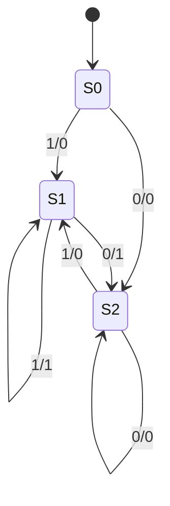

Unit 2?
======

regex, json

2d arrays (design decision)
* jagged arrays (lists of lists)
* 1d array with translation function
* dict of cords


Algorithm to select correct coins for change (at a cash register)
  what happens if we run out of pound coins?


Using and/or/not to drive a seven segment display from a 4 bit number

huffman encoding
encoder and decoder
for dna text string

sound 
sinwave
squarewave
triangle wave
https://mdoege.github.io/PySynth/
https://github.com/mdoege/PySynth

flowchart

oo inheritance
interfaces
intanciation
compositon
polymophisum
abstract, static
public private
UML

binary multiplication of unsinged int
twos compement?

transpositional cypher

language frequency alalysis project
* [Line drawing algorithm](https://en.wikipedia.org/wiki/Line_drawing_algorithm)

Auto video edit project?

assembler -> fetch execute

## Backus-Naur Form (BNF)
context-free language == methods that can be used to describe the syntax of programming languages
bnf describes syntax in unambiguius way
```bnf
<intger> ::= <digit> | <digit> <integer>
<digit> ::= 0|1|2|3|4|5|6|7|8|9
```
integer is a set
digit is a terminal

bnf for car reg LLNN LLL

base case?
see graph traversal

## Finite state machines




reverse polish notation

* implement (in static language) (generics?)
  * list
  * queue
  * stack
  * Test harness? 100000 items and timing performance?
graph (weighted directed/undirected)
 traversal
 maths bacars nor form
tree (root, connected, undirected) binary
 traversal
vector (dot product)

djikestras sortest path

hash
hashtables


bubblesort, mergesort

binary search

Time algorithum complexity
Big-O
Linear, polynomial, exponential, logrimimic

sets (finite, infinate, cardinality, subset) cartisian product (membership, union, differnence, intersection)

finite state machines

Regex
    fsm?


unicode

Play a sin wave


output images a raw and use ffmpeg to make video


logic gate for half adder and full adder

asembler
bitshift


Generate pub/private key and send message with commandline

Write simple static http server
  And security vulerbility test
Write a simple email server SMTP/POP/IMAP?
  test with clients? test with containers?

interupts


router gateway cirtificate key-pairs

protocols smpt, pop3 http ftp


json and xml
(off spec yaml)

SQL
primary key, forigen key, composeite key
uuid

er diagram
object diagram

vector - dot-product

functional programming

higher order functions
map, reduce, filter
immutable lists (and manipulation)

depth first search - breth first search

perfect tictactoe ai?

web-cgi?
