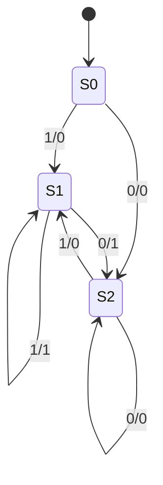

Unit 2?
======

This is not really unit 2 .. it's just a catch-all for other stuff

* [ECT Python Program: Theme Park Ride](https://docs.google.com/document/d/1_Hu-ZJz2p4dyYzyYgjZeORWuLX8PVfcFn7i8MZpPFHM/edit)
> Word problem on estimation:  There are 90 people in line at a theme park ride. Every 5 minutes, 40 people get on the ride and 63 join the line. Estimate how long it would take for 600 people to be in line.

Easy Stuff to be integrated
----------------------------

Sorry - didnt know where to put this
Generate lyrics to "10 green bottles"


isPrime
-------

Create a function that takes an integer and returns true if the number is prime.
https://en.wikipedia.org/wiki/Primality_test


```python

```


* [pages.github.com](https://pages.github.com/)
  * [Creating a GitHub Pages site with Jekyll](https://docs.github.com/en/pages/setting-up-a-github-pages-site-with-jekyll/creating-a-github-pages-site-with-jekyll)
  * [GitHub Pages and DNS](https://docs.github.com/en/pages/configuring-a-custom-domain-for-your-github-pages-site/managing-a-custom-domain-for-your-github-pages-site)
  * [Getting Started with GitHub Pages](https://guides.github.com/features/pages/)

Using and/or/not to drive a seven segment display from a 4 bit number

huffman encoding
encoder and decoder
for dna text string

sound 
sinwave
squarewave
triangle wave
https://mdoege.github.io/PySynth/
https://github.com/mdoege/PySynth

flowchart

oo inheritance
interfaces
intanciation
compositon
polymophisum
abstract, static
public private
UML

binary multiplication of unsinged int
twos compement?

transpositional cypher

language frequency alalysis project
* [Line drawing algorithm](https://en.wikipedia.org/wiki/Line_drawing_algorithm)

Auto video edit project?

assembler -> fetch execute

## Backus-Naur Form (BNF)
context-free language == methods that can be used to describe the syntax of programming languages
bnf describes syntax in unambiguius way
```bnf
<intger> ::= <digit> | <digit> <integer>
<digit> ::= 0|1|2|3|4|5|6|7|8|9
```
integer is a set
digit is a terminal

bnf for car reg LLNN LLL

base case?

## Finite state machines




reverse polish notation

* implement (in static language) (generics?)
  * list
  * queue
  * stack
  * Test harness? 100000 items and timing performance?
graph (weighted directed/undirected)
 traversal
tree (root, connected, undirected) binary
 traversal
vector (dot product)

djikestras sortest path

hash
hashtables


bubblesort, mergesort

binary search

Time algorithum complexity
Big-O
Linear, polynomial, exponential, logrimimic

sets (finite, infinate, cardinality, subset) cartisian product (membership, union, differnence, intersection)

finite state machines

Regex
    fsm?


unicode

Play a sin wave


output images a raw and use ffmpeg to make video


logic gate for half adder and full adder

asembler
bitshift


interupts


router gateway cirtificate key-pairs

protocols smpt, pop3 http ftp


json and xml
(off spec yaml)

SQL
primary key, forigen key, composeite key
uuid

er diagram
object diagram

vector - dot-product

functional programming

higher order functions
map, reduce, filter
immutable lists (and manipulation)

depth first search - breth first search

perfect tictactoe ai?

web-cgi?
