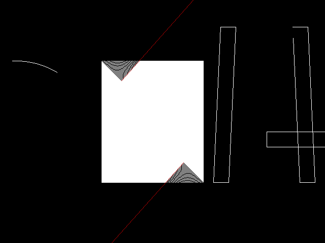
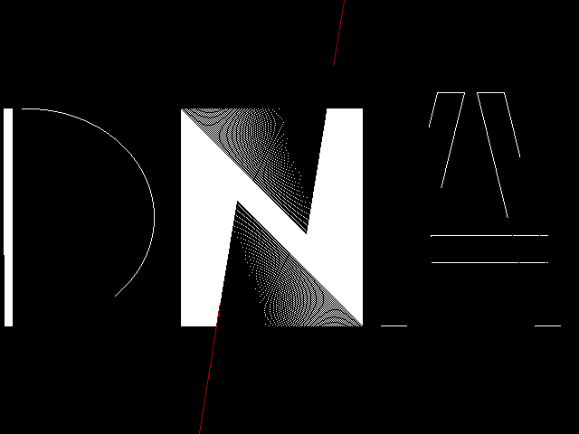
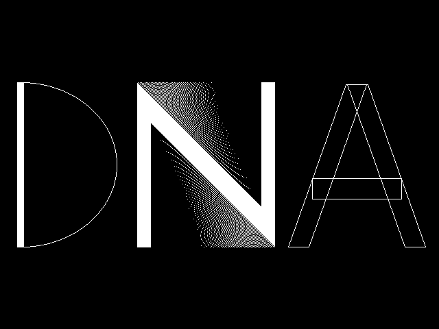
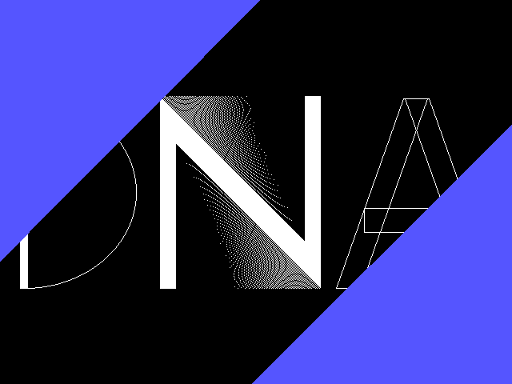

Creative Coding Workshop
========================

Could be a whole day event at uni or a module at GCSE level.

WIP Outline

* Time
    * Day = 2 hours (combined) of talks (not all in one block) + 4 hour independent code in informal environment + Showcase?
    * Suggest 09:00 till 16:00?
* Objective
    * Create a program that creates any visual animation from code (takes no realtime user input)
    * Be as creative as possible, learn something new, just enjoy the exploration
    * Showcase what you build at the end of th day if you have something (optional, no pressure)
* Attendee Prerequisites
    * Some coding knowledge of the fundamentals (any language)
        * loops, functions with params and returns, range of data types, arrays, dynamic collections, sin, modulo, random, min, max
    * (will show examples in Python, Javascript, C#)
* Talks?
    * Why?
    * Demoscene (30min)
        * History
        * Examples
        * [mapOfComputing/demoscene.md](https://github.com/calaldees/mapOfComputing/blob/main/computing/demoscene.md)
    * My Examples + Code (15min)
        * DNA Logo (DOS/Pascal 16 years old)
        * Pygame zoomer
    * Describe algorithms for effects (5min each)
        * Random shapes (squares and circles)
        * Scrolling Stars
        * Particle Shower (mass/velocity)
        * Fire
            * https://github.com/ethanhjennings/webgl-fire-particles
            * https://ethanhjennings.github.io/webgl-fire-particles/
        * Bubbles?
        * Wipe
        * Recursion - tree animate (15min)
        * Game of life?
        * [Mysitfy](https://www.youtube.com/watch?v=uZQr-gHyYFI) [Beziers](https://www.youtube.com/watch?v=nWYI7WxhUbU) Windows XP Screensaver
            * Windows screensaver - algorithm - quadratic line * 4 -  draw over black/last - draw next
                * bounce points around screen (dvd image bounce)
        * Draw Binary Pascals Triangle
    * Techniques
        * Graphics shape libraries + render loop
        * Sin waves for visuals (10min)
        * Tween/Easing-functions (10min)
        * Perlin noise (15min)
        * PCM Audio (from bytes) (15min)
        * Midi arpeggio

TODO:
* Templates for shapes and render loops in a range of languages (scratch, vb.net, python tk, python pygame, java)
* Template tasks
    * Random shapes/colors
    * DVD bounce
    * particles
    * 

Unsorted
========

* assessment/measure? because we are obsessed with this
    * Complexity of code
    * Use of librarys
    * Asthetic

https://mattiasgustavsson.com/wasm/

Demoscene

DNA Logo
--------

At 16 years old, without the internet and only built in librarys/documentation for 'Turbo Pascal 7.0 DOS'. I was able to animate a set of shapes in code

Creating something visually interesting with code 
* Has an infinite skill ceiling
    * Algorithmic complexity
* Individual input
* Social/artistic/peer recondition
