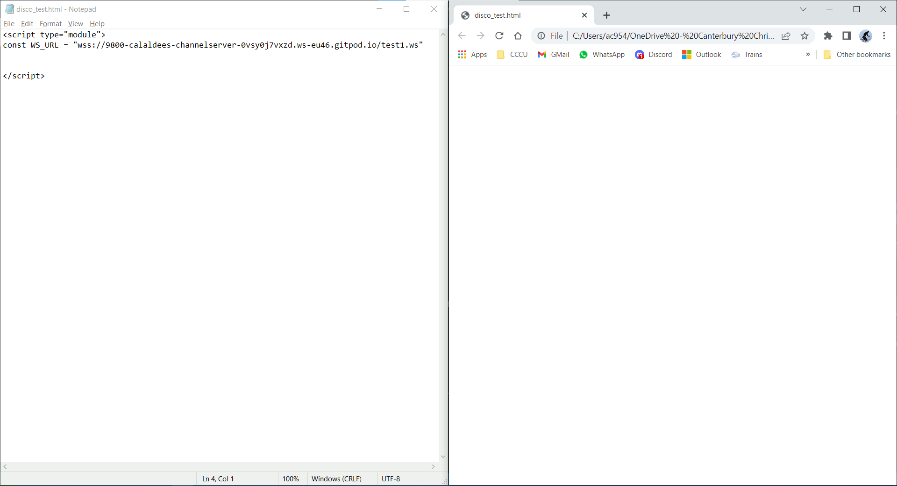

Disco
=====

School activity for KS3, KS4, KS5.


Teacher notes
-------------

### Principle

* Apply/Practical first - to give context - then discuss dissect/understand
* Real industry tools


Keywords
--------

### Computing
* Javascript/browser
* Context + diff
* Client/Server
  * Echo Server
* Event
* Event Driven Programming
* WebSocket
* Protocol
  * version
* BiDirectional
* RGB (color representation)
* Distributed System
* (Network) Message Bus
* Latency
* Synchronisation (A problem, NTP)


### Other discipline/domains
* BPM (Beats per minute)


Activities
----------

* [Launch GitPod - channelServer](https://gitpod.io/#https://github.com/calaldees/channelServer) [github.com/calaldees/channelServer](https://github.com/calaldees/channelServer)
  * See debug page for `test`
  * copy and paste the WS URL from the debug window of `test1`
    * similar to `wss://9800-calaldees-channelserver-0vsy0j7vxzd.ws-eu46.gitpod.io/test1.ws`
* Dev environment
  * setup WS_URL variable beforehand
  * 16:9 screen split in half
    * Plain text editor
      * ctrl + s
    * Web browser (chrome/firefox)
      * ctrl + r
    * 

### Practical - disco.html
* Teacher leads - example
* Gives students sequential `id` numbers
* Demo's bpm
  * single character on keyboard - col count
  * [Caramella Girls - Caramelldansen (Official English Version)](https://www.youtube.com/watch?v=A67ZkAd1wmI) YouTube
    * bpm 167?


Activity
--------

Where could the delay/latency come from?
Think pair share - all the places


Advanced Design
----------------

The server has no logic - we send lots of irrelevant information to each node


---
<style>
.token.inserted {font-weight: bold;}
.token.deleted {text-decoration: line-through;}
</style>
<hr style="page-break-after: always;"/>


# Network Disco Lights - HTML5/Javascript

## Base
Create a file called `disco.html` and open it in a browser
Run the program after each addition by refreshing your browser
```html
<script type="module">
const WS_URL = "ws://localhost:9800/test1.ws"
</script>
```
Open `disco.html` in a web browser
Reload the page each addition by pressing CTRL+F5

Replace `localhost` with URL your teacher gives you.

## Random Screen Color
```diff
 <script type="module">
 const WS_URL = "ws://localhost:9800/test1.ws"
+
+function randomByte() {return Math.floor(Math.random()*255)}
+function updateScreenColor(r,g,b) {
+    r = r || randomByte()
+    g = g || randomByte()
+    b = b || randomByte()
+    document.body.style = `background-color: rgb(${r},${g},${b});`
+}
+
+window.addEventListener('keydown', (event)=>{
+    updateScreenColor()
+})
+
 </script>
```
Press any key on the keyboard

## Listen to Network
```diff
+const socket = new WebSocket(WS_URL)
+window.socket = socket
+socket.addEventListener('message', (event)=>{
+            updateScreenColor()
+})

 </script>
```
When a network message is revived, your screen should change color.

## Protocol Version 1: Computer Id
Change "1" to be a unique Identifier (ID) for your computer. Teacher will give you a number.
```diff
 socket.addEventListener('message', (event)=>{
+        const id = event.data
+        if (id == "1") {
             updateScreenColor()
+        }
 })
```
When your number is sent over a network, your screen should change color.

TODO: `console.log("message", event.data)`

Press F12 to enable developer tools 'console'.
```javascript
socket.send("1")
```
Change the color of our neighbors screen.

## Protocol Version 2: Color
```diff
 socket.addEventListener('message', (event)=>{
-        const id = event.data
+        const [id, r, g, b] = event.data.split(":")
         if (id == "1") {
-            updateScreenColor()
+            updateScreenColor(r,g,b)
        }
 })
```
In console
```javascript
socket.send("1:255:0:0")
```

## Protocol Version 3: Multiple Computer Id's
```diff
 socket.addEventListener('message', (event)=>{
+    const messages = event.data.split("\n")
+    for (let message of messages) {
-        const [id, r, g, b] = event.data.split(":")
+        const [id, r, g, b] = message.split(":")
         if (id == "1") {
             updateScreenColor(r,g,b)
         }
+    }
 })
```
In console
```javascript
socket.send(`
1:255:0:0
2:0:255:0
3:0:0:255
`)
```

## Calculate BPM
* Calculate the Beats Per Minuet (BPM) of a piece of music
* Count/tally the number of beats over 60 seconds
* Disco Time

## Extra
* Join another channel - replace `test1` for different channels
* Start your own server (GitHub login required)
  * https://gitpod.io#https://github.com/calaldees/channelServer


Teacher Notes
=============

Room Setup
----------

 For my outreach workshop I will require the following setup and ready for each student before the session starts.
(See Screenshot attached)
    * Plain text editor (with template open)
    * Web browser (chrome/firefox)

I will know the WS_URL an hour before the session (this is hosted on a cloud server so I can't have it running in advance without costing a lot of money)

I suggest we have
 - a single account
 - I save the template `disco.html` to the desktop
 - Create shortcut on desktop to online form questions
On each machine we
  1.) Technicians log in to each machine
  2.) Open `Desktop/disco.html` in notepad
  3.) SaveAs `Desktop/disco_XX.html`
  4.) Open `Desktop/disco_XX.html` in chrome

I am happy for any additional ideas to help speed the setup of the room.
Let me know your thoughts.


Teacher Code
------------

### disco.html
@import "disco.html" {code_block=true class="line-numbers"}


### To complement: Protocol Version 1: Computer Id

Send 30 separate messages
```javascript
for (let id=0 ; id<30 ; id++) {socket.send(`${id}`)}  // Whole room!
```
Inefficient


Antonymous online form
----------------------

Antonymous open questions - all shown for teacher/class to comment discuss.

I'm going to ask you hard questions deliberately.
Software engineers have to explain their thinking/understanding clearly.

* What is a code 'diff'?
* What is a 'Network protocol'?
* What is 'Event Driven Programming'?
* What are the challenges with networks, timing and latency?
* Is what we have created a 'Distributed system'? Give reasons why?

MSForms with short link? Shortcut on desktop?

---
<hr style="page-break-after: always;"/>

Remote Control Project
======================

display.html
------------

Display - image, text, video (mp4, youtube), redirect-webpage (frame?) (need snippets)


```javascript
document.body.style = "margin:0; background-color:black;"  // remove the default html border
```

```javascript
function iframe(url) {
  document.body.innerHTML = `<iframe style="width: 100%; height: 100%;" src="${url}" frameborder="0" allowfullscreen></iframe>`
}
iframe("https://canterbury.ac.uk/")
```

```javascript
function youtube(video_id, start_seconds=0) {
  iframe(`https://www.youtube.com/embed/${video_id}?&autoplay=1&start=${start_seconds}`)
}
youtube("0jjeOYMjmDU")
```

```javascript
function image(image_url) {
  document.body.innerHTML = ``
}
image("https://upload.wikimedia.org/wikipedia/commons/6/60/Augustine_Abbey.jpg")
// todo: animate, fade, blur
```

```javascript
function media(url) {
  document.body.innerHTML = `<video controls autoplay style="width: 100%; height: 100%; object-fit: contain;"><source src="${url}"></video>`
}
media("https://file-examples-com.github.io/uploads/2017/04/file_example_MP4_1280_10MG.mp4")
// or mp3/ogg
```
consider `mute` and `loop` and `controls`

```javascript
function speak(text) {
  window.speechSynthesis.speak(new SpeechSynthesisUtterance(text));
}
speak('Hello World');
```

```javascript
function text(text) {
  document.body.innerHTML = `<p>${text}</p>`
}
text('Hello World');
// TODO: set font size and color and font? center? wrap?
// Animation? scroll in?
```


```javascript
const renderer_functions = {iframe, youtube, image, media, speak, text}

const function_name, payload = event.data.split("---")
renderer_functions[function_name](payload)
```
Explain use `---` as split character. Don't use `:` because this is a legal character in urls


control.html
------------

Remote control - with buttons and text box's. Slider? color picker?

```javascript
const button = document.createElement("button")
button.textContent = "Console Hello"
button.addEventListener("click", ()=>console.log("hello"))
document.body.appendChild(button)
```

```html
<h1>Test</h1>

<button id="button1">Test Button 1</button>

<input type="text" id="text1"/>
<button id="button2">Test Button 2 - from textbox</button>

<label for="points">Points (between 0 and 10):</label>
<input type="range" id="points" name="points" min="0" max="10"> 

<script type="module">
    function do_thing(text) {
        console.log(text)
    }

    document.getElementById("button1").addEventListener("click", ()=>{
        do_thing('hello1')
    })

    document.getElementById("button2").addEventListener("click", ()=>{
        const text = document.getElementById("text1").value
        do_thing(`Text in the box is ${text}`)
    })
</script>
```


* Browser [Event reference](https://developer.mozilla.org/en-US/docs/Web/Events#event_listing)
```javascript
const $text = document.createElement('div');
document.body.appendChild($text);
window.addEventListener('pointermove', (event)=>{
    $text.textContent = `x=${Math.round(event.x/window.innerWidth*100)}% y=${Math.round(event.y/window.innerHeight*100)}%`
})
```


Image blur - guess what it is - slowly unblur

This is sort of What chromecast is


control.html + display.html -> comited to same repo with README as to how to launch the server